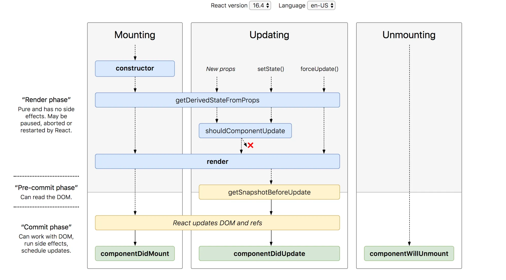

> 哎，真不想看😖，还是翻译一遍吧，印象更深刻

## React生命周期

### 常规方法

#### render()

render方法是使用最多的生命周期方法，你能在class中看到他，因为它是class的必须参数

它会在组建生成和更新的时候调用

render方法必须是纯净的函数并且没有副作用

#### componentDidMount()

当你的组建已经被生成并且准备好了，就到了component Did Mount方法运行的时候

它会在组件准备好的时候运行，这是调用API的好机会

在这里使用setState方法，你将会在组件渲染之前更新组件，所以你并不会看到两次渲染结果

但是你最好谨慎使用，因为这会导致性能问题，你最好应该在构造函数中就定义好state

#### componentDidUpdate()

这个方法将在组件更新的时候调用，最常见的就是在更新组件的时候进行额外的DOM更新

你可以在这个方法中调用setState，但是你最好先用默认参数来判断，防止无限循环

比如：

```javascript
componentDidUpdate(prevProps){
  if(this.props.userName !== prevProps.userName){
    this.fetchData(this.props.userName)
  }
}
```

#### componentWillUnmount()

这个方法将在组件被销毁之前调用

### 非常规方法

#### shouldComponentUpdate()

这个方法在你不想让react自动在数据变动的时候渲染的时候帮助你

注意这个方法要保守使用

```javascript
shouldComponentUpdate(nextProps, nextState){
  return this.props.title !== nextProps.title || 
    this.state.input !== nextState.input
}
```

#### static getDerivedStateFromProps()

这是react团队新增的方法

这可以作为之前的`componentWillReceiveProps()`方法的安全备用选择

它在render方法之前调用

这是一个静态方法所以不能访问“this”

该方法返回一个对象来对应props更新state

它可以返回null，当不需要更新state

这个方法很少会用，一般当组件的state依赖于props的时候会使用

```javascript
static getDerivedStateFromProps(props, state){
  if(props.currentRow !== state.lastRow){
    return{
      isScrollingDown: props.currentRow > state.lastRow,
      lastRow: props.currentRow
    }
  }
  return null;
}
```

当一个组件要比较前后children来决定淡入淡出的时候可能会用到

#### getSnapshotBeforeUpdate(prevProps, prevState)

这是之前的`componentWillUpdate()`方法的安全备选

它在DOM更新前调用，它的返回值会传递到`componentDidUpdate`

#### recap图解

